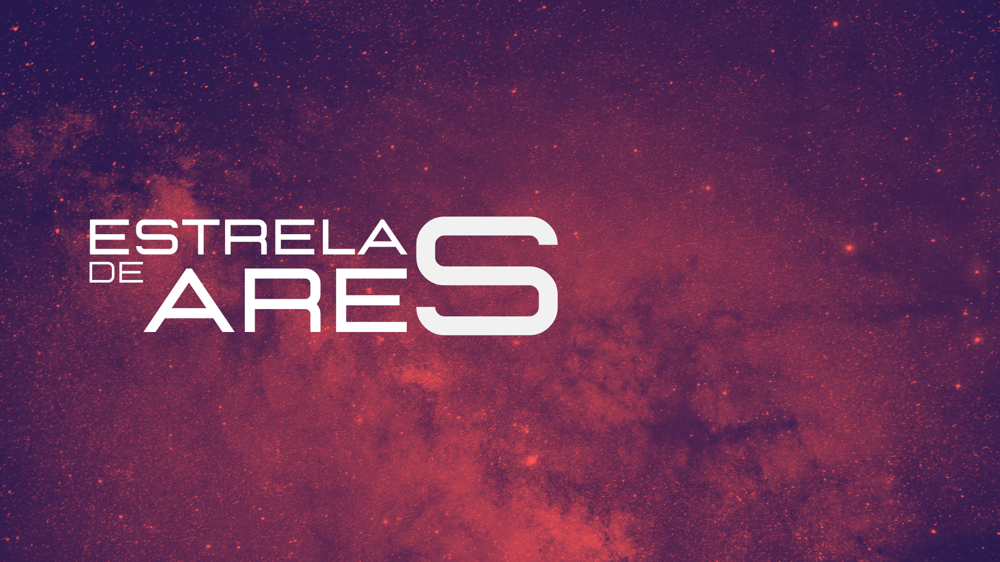
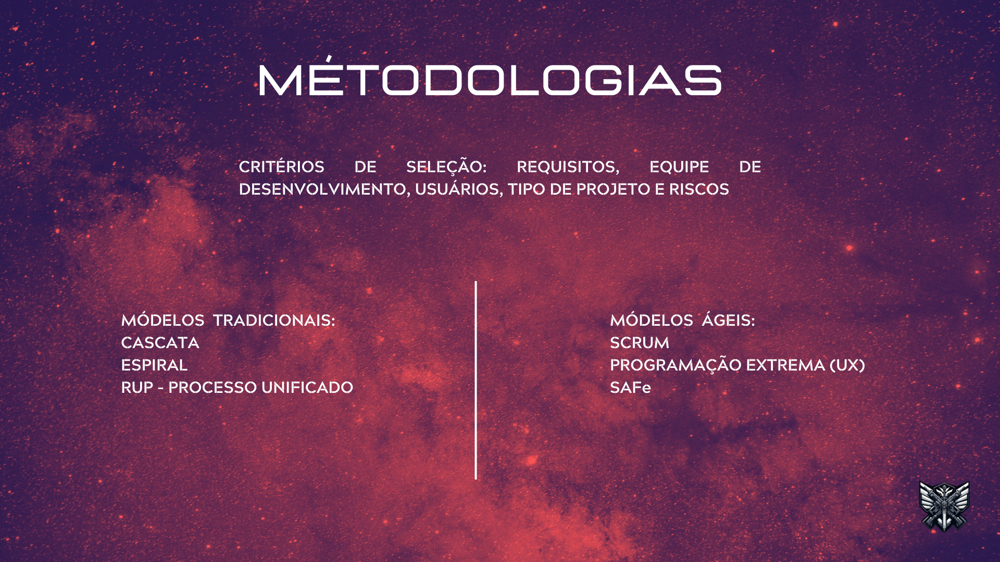
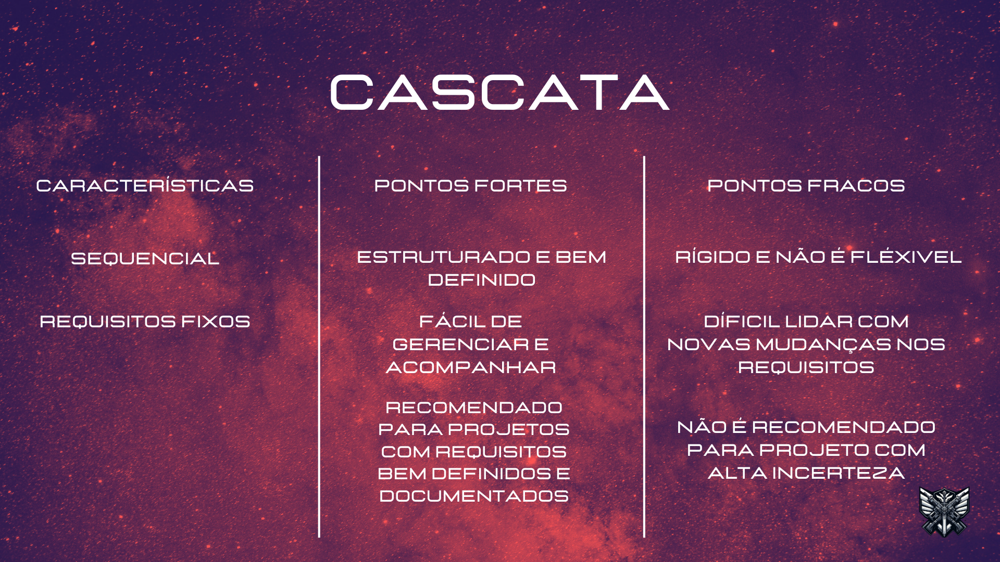
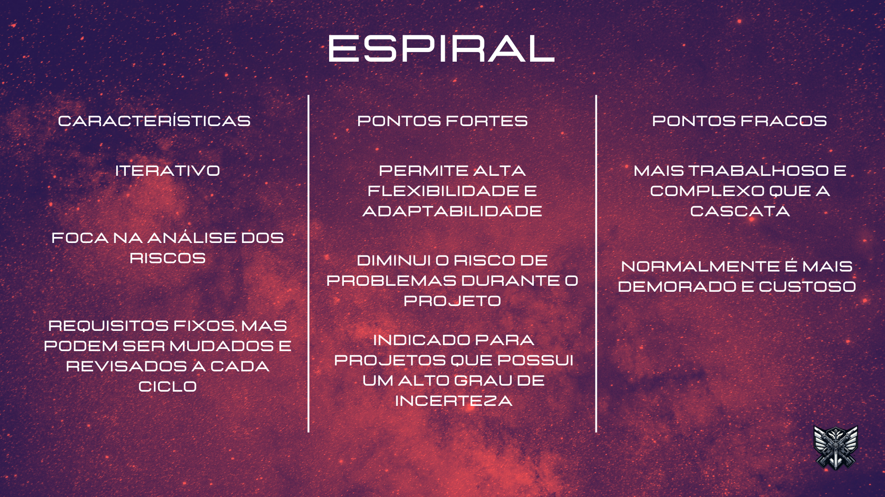
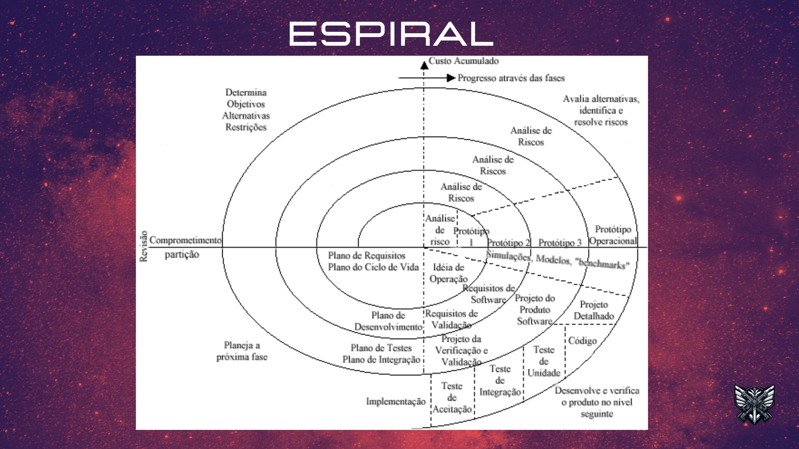
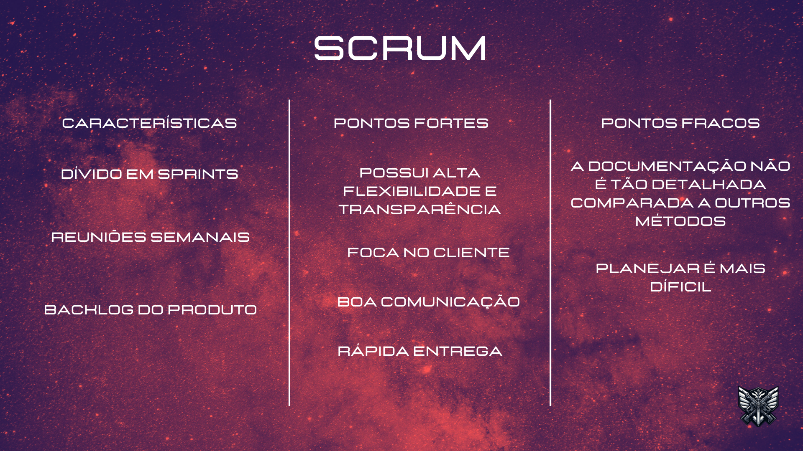
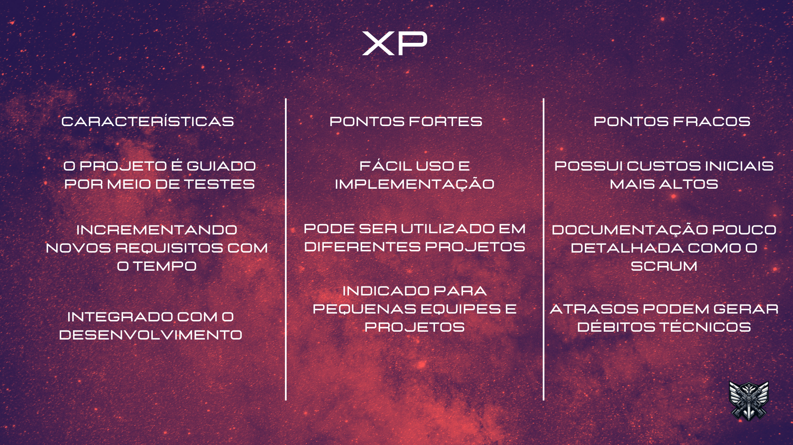
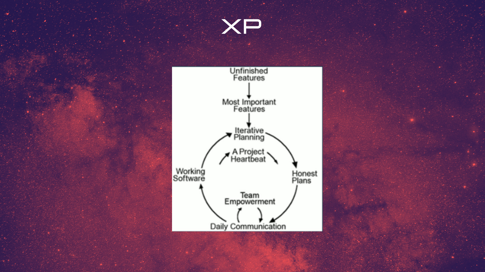
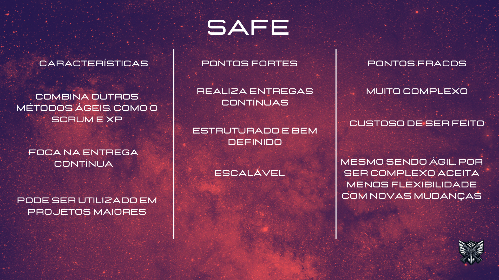

# Esw e Ciclos de Vida

# Slides 

## Histórico de Revisão:
Data | Versão | Descrição | Autor | Revisores 
---- | ------ | --------- | ----- | ---------
17/04/24 | 1.0 | Criação do documento | Marco Tulio, Joyce Dionizio | Lucas Antunes