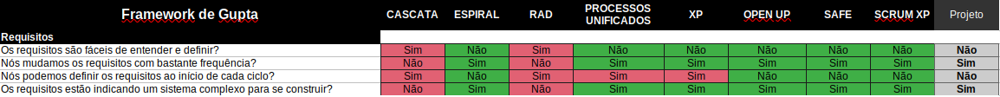
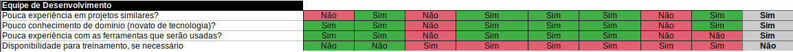
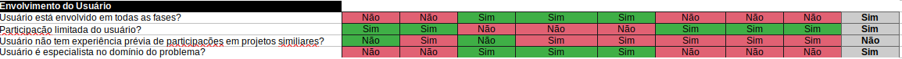
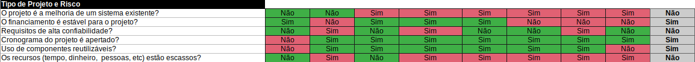
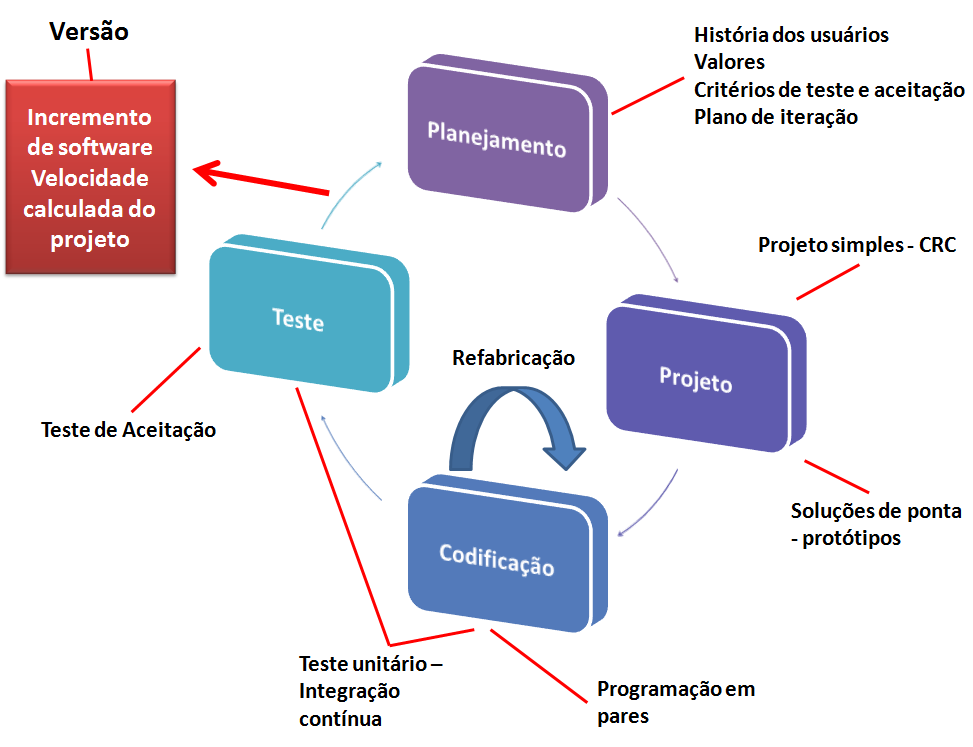
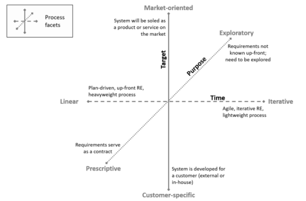
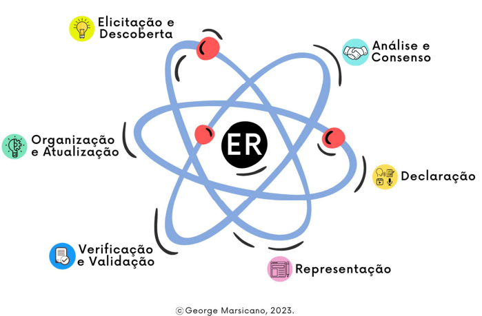
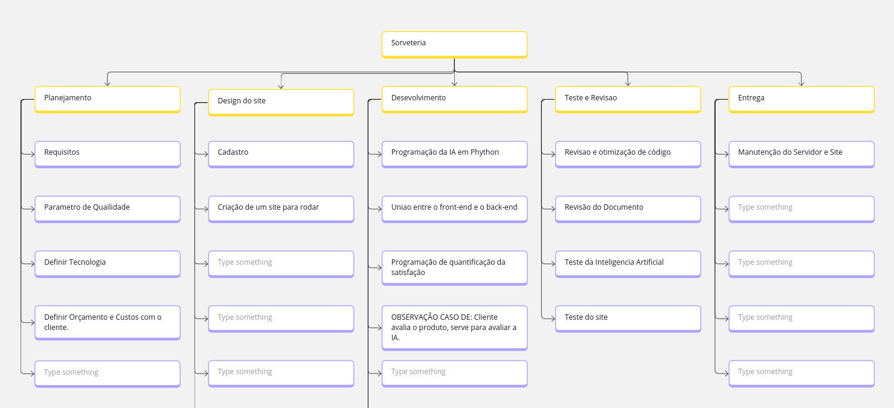

# 3. Processo de Desenvolvimento de Software

## 3.1 Metodologia

Baseado na proposta de Gupta (2019), foi respondido um conjunto de questões distintas sobre determinados tópicos para definir a abordagem que melhor se encaixa ao projeto e time. Tópicos norteadores:

1. Requisitos
2. Equipe de Desenvolvimento
3. Usuários
4. Tipo de Projeto e Riscos Associados

### 3.1.1 Requisitos

Figura 1 - Modelo Gupta para requisitos (fonte: Gupta, 2019)

Pergunta | Nosso contexto
-------- | --------------- 
Os requisitos são fáceis de entender e definir? | Não
Nós mudamos os requisitos com bastante frequência? | Sim
Nós podemos definir os requisitos ao início de cada ciclo? | Não
Os requisitos estão indicando um sistema complexo para se construir? | Sim

Conclusão: Em termos de requisitos, destaca-se o modelo espiral, OpenUp, Safe e ScrumXP.

### 3.1.2 Equipe de Desenvolvimento

Figura 2 - Modelo Gupta para equipe de desenvolvimento (fonte: Gupta, 2019)

Pergunta | Nosso contexto
-------- | --------------
Pouca experiência em projetos similares? | Sim
Pouco conhecimento de domínio (novato na tecnologia)? | Sim
Pouca experiência com as ferramentas que serão usadas? | Sim
Disponibilidade para treinamento, se necessário | Não

Conclusão: Em termos de equipe de desenvolvimento, destaca-se o modelo espiral.

### 3.1.3 Usuários

Figura 3 - Modelo Gupta para usuários (fonte: Gupta, 2019)

Pergunta | Nosso contexto 
-------- | -------------- 
Usuário está envolvido em todas as fases? | Sim. 
Participação limitada do usuário? | Sim.
Usuário não tem experiência anterior em participação em projetos similares? | Não.
Usuário são especialistas no domínio do problema? | Sim.

Conclusão: Em termos de usuário, destaca-se o modelo RAD.

### 3.1.4 Tipo de Projeto e Risco Associado

Figura 4 - Modelo Gupta para tipo de projeto e risco associado (fonte: Gupta, 2019)

Pergunta | Nosso contexto
-------- | --------------
O projeto é melhoria de um sistema existente? | Não
O financiamento está estável para o projeto? | Sim
Requisitos de alta confiabilidade? | Não
Cronograma do projeto é apertado? | Sim
Uso de componentes reutilizáveis? | Sim
Os recursos (Tempo, dinheiro, pessoas etc) estão escassos? | Não

Conclusão: Em termos de Tipo de Projeto e Risco Associado, destaca-se o RAD.

### 3.1.5 Escolha do Processo de Desenvolvimento de Software

Figura 5 - Ciclo XP

Utilizando como base os resultados do framework Gupta, cujo considera baixo conhecimento da equipe, alta participação do cliente no projeto e riscos associados ao projeto, a equipe utilizará seguirá uma abordagem dirigida à plano, utilizando o método ágil XP (Extremme Programming).

## 3.2 Ferramentas

Para a execução dessa metodologia, escolheu-se as seguintes Ferramentas de organização e controle da equipe:

- **Gerenciamento de tarefas**: GitHub Projects
- **Comunicação:** WhatsApp, Discord (Reunião de Equipe), Google Meet (Reunião com Cliente)
- **Versionamento**: GitHub
- **Interface de Desenvolvimento**: VSCode
- **Desenvolvimento de ideias e *frameworks* da disciplina**: Miro
- **Prototipação**: Figma

## 3.3 Processos e Procedimentos

### 3.3.1 Escolhas do Processo de Engenharia de Requisitos

Figura 8 - Faceta da engenharia de requisitos (fonte: MARSICANO, 2023)

Com base nas Facetas do Processo de ER (IREB, 2022), foi definido que é um processo de ER participativo, visto que: 

1. Alvo é um Cliente Específico; 
2. O propósito é exploratório; 
3. Tempo é interativo.

### 3.3.2 Atividades do Processo de Engenharia de Requisitos

Figura 9 - Atividades da ER (fonte: MARSICANO, 2023).

Para isso, a equipe irá incluir o processo ER na metodologia de desenvolvimento XP da seguinte maneira:

Atividade | Método | Ferramenta | Entrega | Fase da aplicação
--------- | ------ | ---------- | ------- | -----------------|
Elicitação e Descoberta | Entrevista com o Cliente e Brainstorming | Google Meet, Lean Inception | Documento de Requisitos Funcionais e Não Funcionais | Aplicada na fase de Planejamento
Análise e Consenso | Brainstorming SWOT | Jira | História de Usuários | Aplicada na fase de Planejamento
Declaração | Critétios de Aceitação | GitHub | Épicos, Tasks, Prazos, MVP | Aplicada na fase de Projeto
Representação | Figma | GitHub | Protótipo de Alta Fidelidade |  Aplicada na fase de Projeto
Implementação | Pair Programming | VsCode, Git | Código Fonte |  Aplicada na fase de Codificação
Verificação e Validação | Teste de Aceitação, Teste de Software | GitHub, JUnit, PyTest | Relatório de Testes e Validações dos Requisistos |  Aplicada na fase de Testes
Organização e Atualização | Backlog SAFe  | Jira | Relatório do Backlog da semana |  Aplicada na fase de Planejamento
Usabilidade | Análise Heurística | Dashboard | Relatórios de Usabilidade | Aplicada na fase de Testes

### 3.3.3 Estrutura Analítica do Projeto

Figura 10 - Estrutura Analítica do Projeto

#