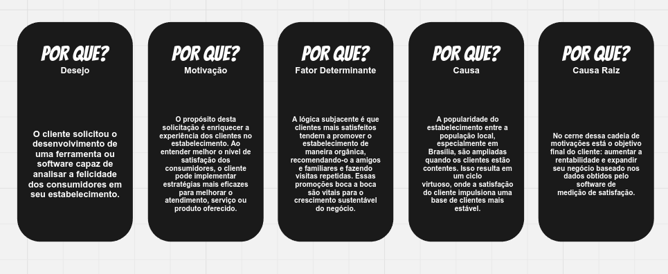

# 1. Visão Geral do Produto

## 1.1 Problema/Desejo

O problema identificado reside na dificuldade de medir de forma quantitativa o nível de satisfação dos clientes em uma sorveteria. Atualmente, o proprietário do estabelecimento não possui meios eficazes para capturar e analisar a felicidade dos consumidores, o que é fundamental para aprimorar a experiência no local. Para aprofundar o entendimento deste problema, foi empregado a técnica dos 5 Porquês, visando descobrir as causas raízes e seus principais motivadores.

Figura 1 - Técnica dos 5 porquês do grupo (fonte: autores, 2023)

## 1.2 Declaração de Posição do Produto

Para | Proprietários e gerentes de sorveterias 
---- | ---------------------------
Quem | Deseja medir e entender a satisfação dos clientes de forma precisa e em tempo real
O RISO | É um software de análise de expressões faciais baseado em visão computacional
Que |  Monitora e quantifica os sorrisos dos clientes, proporcionando um indicativo claro de sua satisfação durante o atendimento
Ao contrário | De métodos tradicionais de feedback como formulários e enquetes, que podem não capturar o sentimento imediato e espontâneo dos clientes
Nosso produto | Oferecerá uma medição dinâmica e interativa da satisfação do cliente, permitindo intervenções imediatas para melhorar a experiência do usuário

## 1.3 Objetivos do Produto

Implementar um sistema de avaliação de satisfação do cliente na sorveteria, utilizando uma tecnologia de detecção de sorrisos, para entregar as circunstâncias, sendo elas básicas, mais comuns capazes de provocar um sorriso aos clientes. O objetivo é utilizar essas informações para direcionar mais esforços em produtos, serviços e iniciativas que vão amplificar esses momentos de felicidade, melhorando assim a experiência do cliente.

## 1.4 Objetivos Secundários

**Analisar Picos de Felicidade:** Identificar os momentos exatos e os fatores que mais contribuem para a satisfação do cliente;
**Aprimorar a Experiência do Cliente:** Utilizar as informações obtidas através da análise de dados para, visando potencializar a felicidade durante a experiência na sorveteria;
**Capacitação da Equipe:** Treinar os funcionários para interpretar os dados do sistema de detecção de sorrisos e agir com base nas informações coletadas, visando melhorar a interação com os clientes e a eficiência no serviço.

## 1.5 Tecnologias a Serem Utilizadas

- Python
- HTML
- CSS
- Node.js
- MySQL
