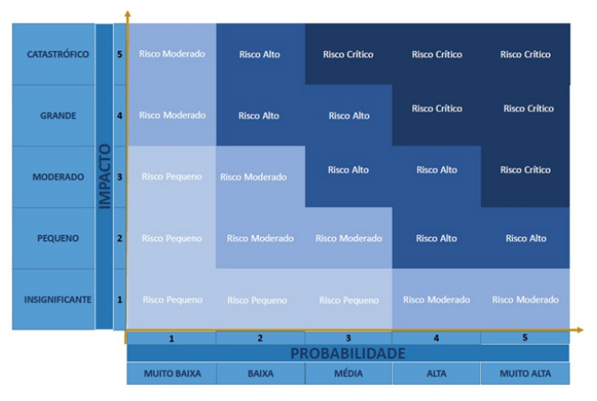

# 2.	Visão Geral do Projeto
## 2.1	Organização do Projeto
Papel | Atribuições | Responsável | Participantes
----- | ----------- | ----------- | -------------
Pessoa Desenvolvedora | Codificar o produto, realizar refatoração, testar, configurar, versionar, evoluir, integrar, documentar, ata das reuniões, estratégia de código | Lucas | Jesus Gabriel,Daniel Rodriguel, João Pedro, Marco Tulio, Joyce
Líder do Time | Delegar tarefas, duração da Ciclo, organização das atividades, one-to-one com os membros, estratégia de produto | Daniel | Lucas
Pessoa Engenheira de Requisitos | Descobrir, elicitar, analisar, consensuar, declarar, representar, organizar e atualizar requisitos | Marco Tulio | Lucas,Daniel,Joyce
Cliente | Fornecer insumos para requisitos, fornecer feedbacks sobre os produtos, priorizar requisitos | Joyce | Arthur
Monitor | Verificar requisitos, fornecer feedbacks sobre o processo de ER, auxiliar em dúvidas da equipe acerca da disciplina de requisitos, articular os interesses do professor | João Pedro | Pedro Henrique

## 2.2	Planejamento das Fases do Projeto
Ciclo | Produto (Entrega) | Data Início | Data Fim
---- | ----------------- | ----------- | --------
Ciclo 1 | Requisitos descobertos, elicitados, analisados e consensuados | 22/04/24 | 29/04/24
Ciclo 2 | Requisitos validados, verificados e declarados | 30/04/24 | 12/05/24
Ciclo 3 | Requisitos organizados e atualizados, escopo definido do MVP e Funcionalidades Incrementais  | 13/05/24 | 19/05/24
Ciclo 4 | Bateria de Funcionalidades | 20/05/24 | 26/05/24
Ciclo 5 | Bateria de Funcionalidades | 27/05/23 | 12/06/23
Ciclo 6 | Bateria de Funcionalidades | 03/06/23 | 09/06/23
Ciclo 7 | Bateria de Funcionalidades | 10/06/23 | 16/06/23
Ciclo 8 | Bateria de Funcionalidades | 17/06/23 | 23/06/23
Ciclo 9 | Bateria de Funcionalidades | 24/06/23 | 30/06/23
Ciclo 10 | Bateria de Funcionalidades | 01/07/23 | 07/07/23

## 2.3	Matriz de Comunicação
Descrição | Área/Envolvidos | Periodicidade | Produtos Gerados
--------- | ----------------- | ----------- | ----------------
Acompanhamento das atividades em progresso | Equipe do Projeto | semanal | Relatorio de situação do projeto
Acompanhamento de Ciclo | Equipe do Projeto e Monitor | Semanal | Ata da Reunião, Relação de Feedbacks sobre as entregas do produto
Comunicar a situação do projeto | Equipe do Projeto e Professor | Mensalmente | Artefatos solicitados, Relação de Feedbacks do Professor

## 2.4	Gerenciamento de Riscos
A análise e gerenciamento de riscos referem-se à identificação dos possíveis pontos que podem representar riscos para o projeto. Precisam ser acompanhados, a cada acompanhamento das fases, se referindo assim, ao projeto como um todo e não apenas ao produto.

Segundo Charette, existem três tipos de riscos de Software (PRESSMAN,2006):

1. **Riscos de projeto**: mostram problemas potenciais de orçamento, cronograma, organizacionais que impactam o projeto;
2. **Riscos técnicos**: perturbam a qualidade e a entrega do software. Também mostram problemas potenciais de projeto, implementação, interface, verificação e manutenção;
3. **Riscos de negócio**: ameaçam a viabilidade do software e do produto e apresentam 5 variações:
    1. Risco de Mercado: criar um excelente produto ou sistema que ninguém realmente quer;
    2. Risco Estratégico: criar um produto que não se encaixe mais na estratégia geral de negócios da empresa;
    3. Risco de Vendas: criar um produto que a equipe de vendas não sabe como vender;
    4. Risco Gerencial: perda de suporte da alta gerência devido à mudança no foco ou mudança de profissionais;
    5. Risco de Orçamento: perda do orçamento ou do comprometimento dos profissionais.

A análise dos riscos levará em consideração 2 variáveis:

### 2.4.1 Probabilidade
A probabilidade indica 

Probabilidade | Intervalo | Peso 
------------- | --------- | ----
**Muito Alta** | 81% à 100% | 5
**Alta** | 61% à 80% | 4
**Média** | 41% à 60% | 3
**Baixa** | 21% à 40% | 2
**Muto Baixa** | 0% à 20% | 1

### 2.4.2 Impacto
Para se quantificar o impacto do risco no projeto o custo, o tempo, o escopo e a qualidade devem ser levados em conta:

Impacto | Descrição | Peso 
------------- | --------- | ----
**Catastrófico** | Impacto Inviabiliza o Projeto | 5
**Grande** | Há grande impacto no desenvolvimento do projeto | 4
**Moderado** | Possui certo impacto, porém é facilmente recuperado | 3
**Pequeno** | Pouco impacto no desenvolvimento do projeto | 2
**Insignificante** | Impacto pouco expressivo no desenvovimento do Projeto | 1

### 2.4.3 Prioridade
Através da equação _[(Probabilidade) x (Impacto)]_ é possível calcular a prioridade dos riscos. A partir desses valores é determinada a urgência da inicialização de medidas de mitigação e resolução dos riscos, tal como na matriz abaixo:

 Figura 1 - Matriz de Riscos (UFV, 2021) 

### 2.3.4 Histórico de Riscos:
Ciclo | Tipo de Risco | Probabilidade | Impacto | Grau do Risco - Prioridade | Contramedida Tomada 
----- | ------------- | ------------- | ------- | -------------------------- | -------------------
Ciclo 1 | Risco de Projeto | Muito Baixa | Catastrófrico | Risco Moderado | Após a greve de docentes, todo o cronograma foi redefinido
Ciclo 2 | Risco de Projeto | Média | Pqueno | Risco Pequeno | Alocação de mais responsáveis em certas atribuições 
Ciclo 2 | Risco de Projeto | Baixa | Grande | Risco Alto | Adoção de outros meios de comunicação com o Cliente

## 2.5	Critérios de Replanejamento
Os critérios de replanejamento referem-se à identificação dos pontos que, caso ocorram, causarão um replanejamento do projeto. Precisam ser acompanhados a cada Ciclo, referindo-se assim, ao projeto como um todo e não apenas ao produto.

### 2.5.1 Identificação de Critérios:
#### C01 - Alteração nos prazos das entregas
**Categoria:** Risco de Projeto. 
**Causa:** Atrasos ou imprevistos provocaram débitos de algumas atividades. 
**Consequência:** Extensão dos prazos das atividades debitadas.

#### C02 - Alteração das Tecnologias do projeto
**Categoria:** Risco Técnico. 
**Causa:** Troca de linguagem de programação ou qualquer ferramenta de gestão e controle do time. 
**Consequência:** Refatoração do código ou reorganização do projeto nas novas ferramentas de gestão.

#### C03 - Alteração no Processo de Engenharia de Requisitos ou Desenvolvimento de Software
**Categoria:** Risco Técnico. 
**Causa:** Mudança no método de organizção do time, método de organização dos requisistos ou produção.
**Consequência:** Reorganização dos papéis do time e atualização de documentação dos requisistos e do processo.

#### C04 - Alteração no Escopo do Projeto
**Categoria:** Risco de Projeto. 
**Causa:** Surgimento de novos requisitos. 
**Consequência:** Replanejamento do projeto.

#### C05 - Barreiras externas para execução do projeto, tais como: aparatos legais, valor financeiro inacessível, capacidade dos hardwares dos desenvolvedores, etc
**Categoria:** Risco Técnico. 
**Causa:** Qualquer problema não gerado pelo time de desenvolvimento, isto é, problemas fogem do controle do processo de desenvolvimento. 
**Consequência:** Estudo do problema e adaptação do time para reverter o problema.

#### C06 - Saída de algum membro da equipe
**Categoria:** Risco de Projeto. 
**Causa:** Membro retirou ou trancou a disciplina. 
**Consequência:** Realocação dos membros desenvolvedores nas atividades do projeto.

#### C07 - Divergência de horários entre membros da equipe
**Categoria:** Risco de Projeto. 
**Causa:** Membros com grades horárias muito distintas. 
**Consequência:** Dificuldade para reunir toda a equipe e realizar os pareamentos.

#### C08 - Dificuldades da equipe com as novas tecnologias inseridas
**Categoria:** Risco Técnico. 
**Causa:** Inexperiência de alguns membros. 
**Consequência:** Surgimento de dívidas técnicas pela dificuldade em realizar os objetivos propostos.

#### C09 - Ausência de membros durante reuniões do grupo
**Categoria:** Risco de Projeto. 
**Causa:** Membros sobrecarregados ou desestimulados com o projeto. 
**Consequência:** Membros perdidos na sprint e maior carga de trabalho para o restante da equipe.

#### C10 - Problemas pessoais ou de saúde
**Categoria:** Risco de Projeto. 
**Causa:** Problemas pessoais/doenças ou viagens dos membros da equipe. 
**Consequência:** Capacidade de trabalho da equipe prejudicada e atrasos no cronograma.

#### C11 - Falta de comprometimento dos membros com o projeto
**Categoria:** Riscos de Projeto. 
**Causa:** Desânimo com o curso, problemas pessoais ou de saúde, excesso de compromissos, entre outros. 
**Consequência:** Issues não entregues, dívida técnica e replanejamento.

Os critérios de replanejamento do projeto devem ser acompanhados e atualizados a cada fase. E, aplicados, conforme necessidade.

### 2.3.4 Histórico de Riscos:
Ciclo | Problema | Solução Encontrada | Resultado Esperado
----- | ------------- | ------------- | -------------------
Ciclo 1 | C01 | Paralização do projeto RISO durante a greve e Refurmulação de todo o Cronograma de ciclos | Definição e reestruturação completa do desenvolvmento do Projeto
Ciclo 1 | C11 | Utilização da ferramenta Jira para acompanhar, de forma mais rídiga, o controle do progresso do time | Controle maior sobre as obrigações do time e maior liberdade de produção aos membros
Ciclo 2 | C10 | Redistribuição dos membros nas atividades para suprir os membros que entraram de viagem | As atividades foram uniformemente distribuídas
Ciclo 2 | C09 | Exposição das Pautas debatidas na reunião em forma de ata para os membros ausentes | Acesso à todo o conteúdo perdido para os membros ausentes
Ciclo 2 | C01 | Debitamento da atividade atrasada para o ciclo seguinte e adição de um responsável auxiliar | Conclusão da Atividade no prazo
Ciclo 2 | C11 | Motivação de uma maior comunicação pelo WhatsApp entre os membros | Maior comunicação e engajamento do time com o projeto
